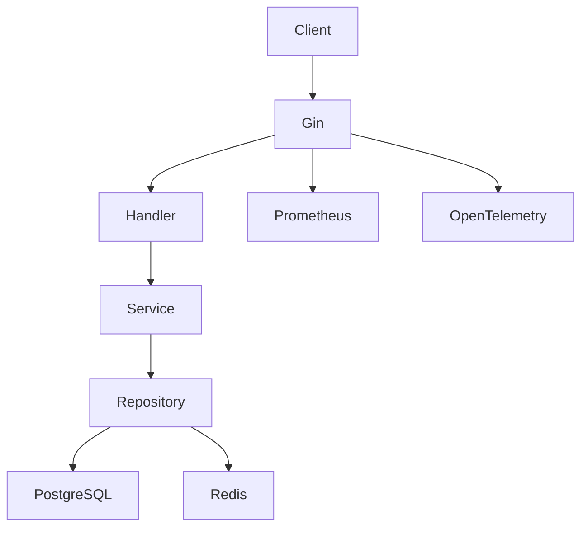

# Task Manager Service

Production-grade Golang task manager service.

## Features

- Gin REST API
- PostgreSQL
- Redis cache-aside
- Swagger/OpenAPI
- Prometheus metrics
- OpenTelemetry tracing
- Docker multi-stage build
- Pagination & filtering
- Unit & integration tests
- Benchmark & pprof

---

## Run Project

```bash
cp .env.example .env
make docker-compose-buildup
```

---

## Run Migrations

```bash
make migrate-up
```

---

## Run Tests

```bash
make test
```

---

## Generate Coverage

```bash
make coverage
```

---

## Swagger

http://localhost:8080/swagger/index.html

---

## Metrics

http://localhost:8080/metrics

---

## pprof

http://localhost:8080/debug/pprof/

---

## Architecture

Handler -> Service -> Repository -> PostgreSQL
                               -> Redis Cache

---

## Architecture Diagram (Mermaid)



---

## Example Request


### Create Task

```bash
curl --location 'localhost:8080/tasks' \
--header 'Content-Type: application/json' \
--data '{
    "title":"learn golang",
    "description":"practice gin",
    "status":"todo",
    "assignee":"amir"
}'
```

### List Tasks

```bash
curl localhost:8080/tasks
```

### Get Task

```bash
curl localhost:8080/tasks/{task_id}
```

### Update Task

```bash
curl --location --request PUT 'localhost:8080/tasks/{task_id}' \
--header 'Content-Type: application/json' \
--data '{
    "title":"advanced golang",
    "description":"learn clean architecture",
    "status":"doing",
    "assignee":"amir"
}'
```

### Delete Task

```bash
curl --location --request DELETE 'localhost:8080/tasks/{task_id}'
```